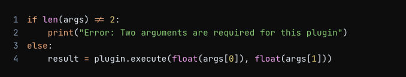
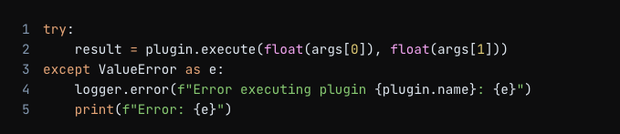
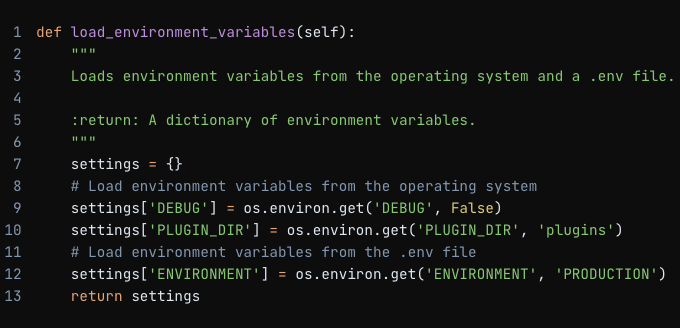

**README.md**
================

**Setup Instructions**
--------------------

1. Clone the repository: `git clone https://github.com/d-yerovi/midterm.git`
2. Install the required packages: `pip install -r requirements.txt`
3. Create a `.env` file in the root directory with the following variables:
	* `DEBUG`: Set to `True` for debug mode, `False` otherwise
	* `PLUGIN_DIR`: Set to the directory where your plugins are located (default is `plugins`)
	* `ENVIRONMENT`: Set to `PRODUCTION` or `DEVELOPMENT` depending on your environment
4. Create a `logging.conf` file in the root directory to configure logging (optional)
5. Create and activate the virtual environment (VE).
    * Create - `virtualenv venv` or `virtualenv -p python3`
    * Activate - `source venv/bin/activate`
    * Deactivate - `deactivate` 

**Usage Examples**
-----------------

1. Run the application: `python main.py`
2. Type `menu` to display the available commands
3. Type `add 2 3` to execute the `add` plugin with arguments `2` and `3`
4. Type `history` to display the calculation history and the history
5. Type `exit` to exit the application

**Architectural Decisions**
-------------------------

### Design Patterns

1. **Plugin Architecture**: The application uses a plugin architecture to allow for extensibility and modularity. Plugins are loaded dynamically from the `PLUGIN_DIR` directory, and each plugin is responsible for executing a specific command.
2. **Command Pattern**: The `CommandHandler` class uses the command pattern to encapsulate the execution of plugins. This allows for a decoupling of the plugin execution from the application logic.
3. **Factory Pattern**: The `load_plugins` function uses a factory pattern to create instances of plugins based on their names.

### Logging Strategy

1. **Logging Configuration**: The application uses a logging configuration file (`logging.conf`) to define the logging settings. This allows for flexibility in configuring the logging behavior.
2. **Logger Hierarchy**: The application uses a logger hierarchy to organize log messages by module and level. This allows for fine-grained control over logging.
3. **Log Levels**: The application uses the following log levels:
	* `INFO`: For informational messages
	* `WARNING`: For warning messages
	* `ERROR`: For error messages
4. **Log Messages**: Log messages are formatted to include the plugin name, command, and result (if applicable).

### Other Design Decisions

1. **Environment Variables**: The application uses environment variables to configure settings such as debug mode and plugin directory.
2. **History Management**: The application uses a pandas DataFrame to store the calculation history. This allows for efficient storage and retrieval of history data.
3. **Menu System**: The application uses a menu system to display available commands and provide a user-friendly interface.

**In-Depth Analysis**
---------------------

### Plugin Architecture

The plugin architecture allows for extensibility and modularity by decoupling the plugin execution from the application logic. This enables developers to create new plugins without modifying the application code. The `load_plugins` function loads plugins dynamically from the `PLUGIN_DIR` directory, and each plugin is responsible for executing a specific command.

### Command Pattern

The command pattern encapsulates the execution of plugins, allowing for a decoupling of the plugin execution from the application logic. This enables the application to execute plugins without knowing the implementation details of each plugin.

### Logging Strategy

The logging strategy provides a flexible and configurable way to manage log messages. The logging configuration file (`logging.conf`) allows developers to define the logging settings, and the logger hierarchy provides a way to organize log messages by module and level. The use of log levels (INFO, WARNING, ERROR) enables developers to control the verbosity of log messages.

### Environment Variables

The use of environment variables provides a way to configure settings such as debug mode and plugin directory without modifying the application code. This enables developers to easily switch between different environments and configurations.

### History Management

The use of a pandas DataFrame to store the calculation history provides an efficient way to store and retrieve history data. This enables the application to display the calculation history in a user-friendly format.

### Menu System

The menu system provides a user-friendly interface for displaying available commands and executing plugins. This enables users to easily navigate the application and execute commands without knowing the implementation details of each plugin.

**Understanding Implementation**
---------------------------------

### Look Before You Leap (LBYL)

In LBYL, it check for potential errors or exceptions before attempting an operation. This approach is often used in languages like C, where error handling is more explicit.

In the code, it is not explicitly using LBYL, but I could have done so by checking the length of the `args` list before executing the plugin, like this:

By checking the length of `args` before executing the plugin, you're looking before you leap, ensuring that the operation will succeed.

### Easier to Ask for Forgiveness than Permission (EAFP)

In EAFP, it attempt an operation and then catch any exceptions that might occur. This approach is often used in languages like Python, where exceptions are a natural part of the language.

In the code, I use EAFP when executing the plugin:

Here, I was attempting to execute the plugin with the provided arguments, and if a `ValueError` occurs (e.g., because the arguments are not valid numbers), I catch the exception and handle it by logging an error and printing an error message.

By using a try/except block, I am asking for forgiveness (i.e., handling the exception) rather than checking for permission (i.e., checking for errors before attempting the operation).

In Python, EAFP is often preferred because it allows for more concise and expressive code, and it's often easier to handle exceptions than to anticipate all possible error scenarios.

### Environment Variables

In my application, I used environment variables to store configuration settings that can be easily changed without modifying the code. I used the `dotenv` library to load environment variables from a `.env` file.

### Loading Environment Variables

In the `App` class, I loaded environment variables using the `load_dotenv()` function from the `dotenv` library. This function loads environment variables from a `.env` file in the root directory of the project.

### Accessing Environment Variables

I accessed environment variables using the os module. I stored the loaded environment variables in a dictionary called `settings`.

### Using Environment Variables

I used environment variables to configure the application. For example, I used the DEBUG environment variable to determine whether to enable debug logging. I also used the `PLUGIN_DIR` environment variable to specify the directory where plugins are located.

Here's an example of how I used the `ENVIRONMENT` environment variable:

This sets the default environment to `PRODUCTION` if it's not already set.

You can find the complete code in the `app.py` file, specifically in the `App` class.